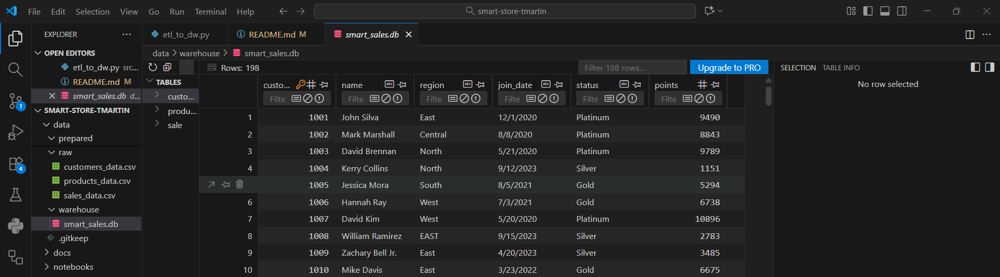
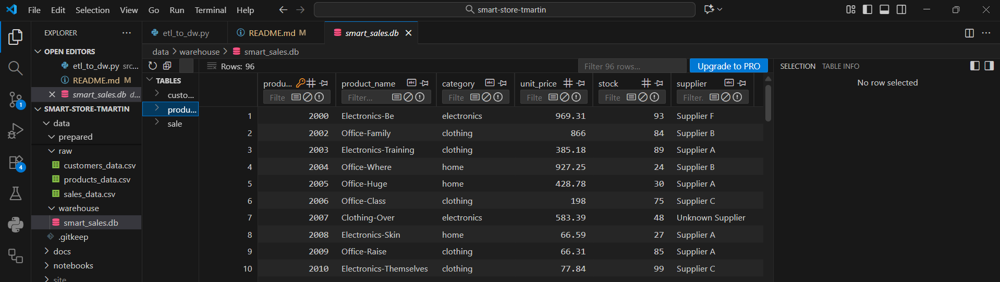
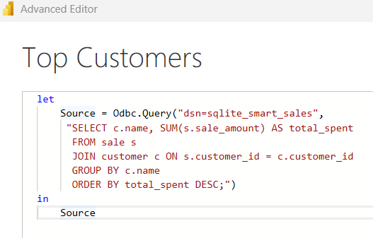
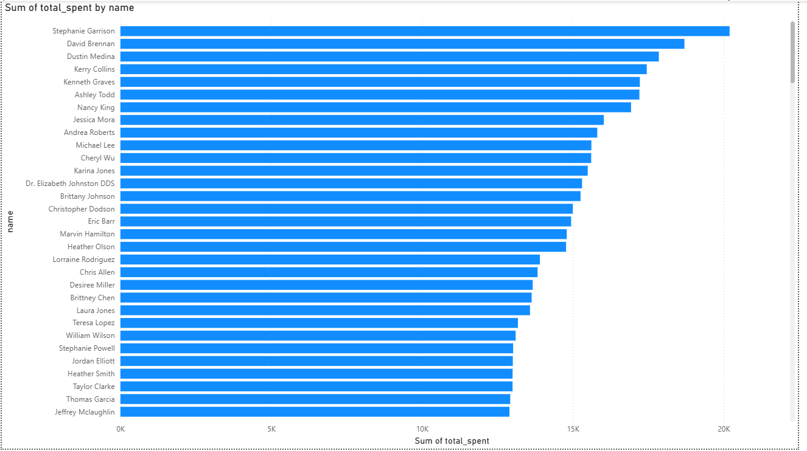
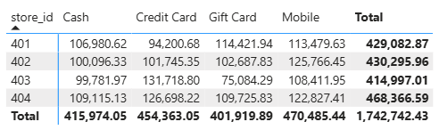
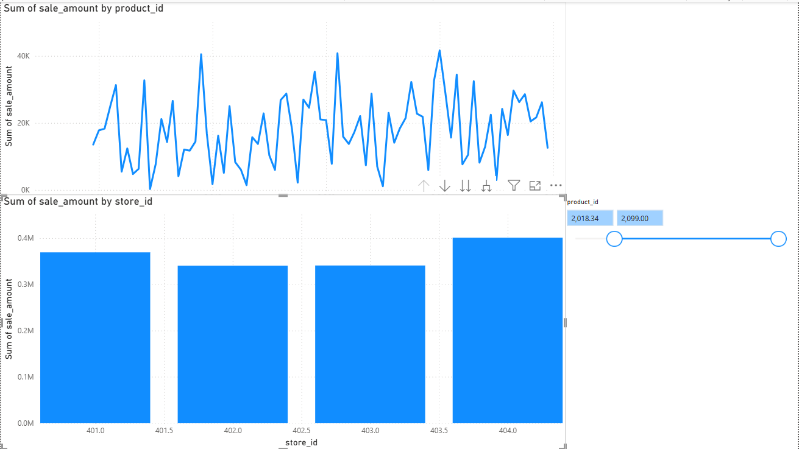
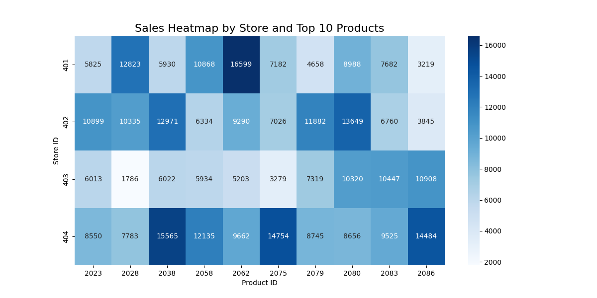

# Pro Analytics 02 Python Starter Repository

> Use this repo to start a professional Python project.

- Additional information: <https://github.com/denisecase/pro-analytics-02
- Project organization: [STRUCTURE](./STRUCTURE.md)
- Build professional skills:
  - **Environment Management**: Every project in isolation
  - **Code Quality**: Automated checks for fewer bugs
  - **Documentation**: Use modern project documentation tools
  - **Testing**: Prove your code works
  - **Version Control**: Collaborate professionally

---

## Module 1 - BI Python (Get Started, add Raw Data)

Goals:
1. Set up a machine for professional BI work.
2. Set up a project (a repository) that we will use over time
3. Use the daily workflow to update our copy of the template and add some raw data files.

[Drivers](https://github.com/denisecase/smart-sales-analysis-goals)

[Basic Files and Folders](https://github.com/denisecase/applied-computer-organization)

<details>
<summary>Click to see Pre-Commit note</summary>

1. Open pyproject.toml
2. Add the pre-commit line below.
3. Save the File
4. Run the commands below.

```shell
[project.optional-dependencies]
dev = [
  "pre-commit", # code quality checks before commits
  "pytest", # run some tests automatically
  "pytest-cov", # coverage report for more visibility
]
docs = [
  "mkdocs",                # Core MkDocs
  "mkdocs-material",       # Modern, responsive theme
  "mkdocstrings[python]",  # Auto-generate API docs from docstrings
  "livereload",            # Enables live reload (auto-refresh on edit)
  "watchdog",              # Faster and more reliable file watching
  "ruff",                  # Needed so mkdocstrings can format signatures
]
```
```shell
uv sync --extra dev --extra docs --upgrade
```
```shell
uv run pre-commit install
```
</details>

Follow the Workflows below.

---

## WORKFLOW 1. Set Up Your Machine

Proper setup is critical.
Complete each step in the following guide and verify carefully.

- [SET UP MACHINE](./SET_UP_MACHINE.md)

---

## WORKFLOW 2. Set Up Your Project

After verifying your machine is set up, set up a new Python project by copying this template.
Complete each step in the following guide.

- [SET UP PROJECT](./SET_UP_PROJECT.md)

It includes the critical commands to set up your local environment (and activate it):

```shell
uv venv
uv python pin 3.12
uv sync --extra dev --extra docs --upgrade
uv run pre-commit install
uv run python --version
```

**Windows (PowerShell):**

```shell
.\.venv\Scripts\activate
```
---

## WORKFLOW 3. Daily Workflow

Please ensure that the prior steps have been verified before continuing.
When working on a project, we open just that project in VS Code.

### 3.1 Git Pull from GitHub

Always start with `git pull` to check for any changes made to the GitHub repo.

```shell
git pull
```

### 3.2 Run Checks as You Work

This mirrors real work where we typically:

1. Update dependencies (for security and compatibility).
2. Clean unused cached packages to free space.
3. Use `git add .` to stage all changes.
4. Run ruff and fix minor issues.
5. Update pre-commit periodically.
6. Run pre-commit quality checks on all code files (**twice if needed**, the first pass may fix things).
7. Run tests.

In VS Code, open your repository, then open a terminal (Terminal / New Terminal) and run the following commands one at a time to check the code.

```shell
uv sync --extra dev --extra docs --upgrade
uv cache clean
git add .
uvx ruff check --fix
uvx pre-commit autoupdate
uv run pre-commit run --all-files
git add .
uv run pytest
```

NOTE: The second `git add .` ensures any automatic fixes made by Ruff or pre-commit are included before testing or committing.

<details>
<summary>Click to see a note on best practices</summary>

`uvx` runs the latest version of a tool in an isolated cache, outside the virtual environment.
This keeps the project light and simple, but behavior can change when the tool updates.
For fully reproducible results, or when you need to use the local `.venv`, use `uv run` instead.

</details>

### 3.3 Build Project Documentation

Make sure you have current doc dependencies, then build your docs, fix any errors, and serve them locally to test.

```shell
uv run mkdocs build --strict
uv run mkdocs serve
```

- After running the serve command, the local URL of the docs will be provided. To open the site, press **CTRL and click** the provided link (at the same time) to view the documentation. On a Mac, use **CMD and click**.
- Press **CTRL c** (at the same time) to stop the hosting process.

### 3.4 Execute

This project includes demo code.
Run the demo Python modules to confirm everything is working.

In VS Code terminal, run:

```shell
uv run python -m analytics_project.demo_module_basics
uv run python -m analytics_project.demo_module_languages
uv run python -m analytics_project.demo_module_stats
uv run python -m analytics_project.demo_module_viz
```

You should see:

- Log messages in the terminal
- Greetings in several languages
- Simple statistics
- A chart window open (close the chart window to continue).

If this works, your project is ready! If not, check:

- Are you in the right folder? (All terminal commands are to be run from the root project folder.)
- Did you run the full `uv sync --extra dev --extra docs --upgrade` command?
- Are there any error messages? (ask for help with the exact error)

---

### 3.5 Git add-commit-push to GitHub

Anytime we make working changes to code is a good time to git add-commit-push to GitHub.

1. Stage your changes with git add.
2. Commit your changes with a useful message in quotes.
3. Push your work to GitHub.

```shell
git add .
git commit -m "describe your change in quotes"
git push -u origin main
```

This will trigger the GitHub Actions workflow and publish your documentation via GitHub Pages.

### 3.6 Modify and Debug

With a working version safe in GitHub, start making changes to the code.

Before starting a new session, remember to do a `git pull` and keep your tools updated.

Each time forward progress is made, remember to git add-commit-push.

---

## Module 2 - BI Python - reading raw data into panda DataFrames

Goals:
1. Create a new file: src/analytics_project/data_prep.py
   1. [P2-data_prep.py](https://github.com/denisecase/smart-sales-starter-files/blob/main/src/analytics_project/data_prep.py)
2. Start with at docstring at the top.
3. Make a place for imports after the docstring.
4. Set up global constants (we'll use these for our project paths).
5. Make a place for defining the reusable function.
6. After the reusable function(s), define a function named main() to hold the initial logic for our processing pipeline.
7. Use the standard Python conditional execution block to run the main() method when we execute this module directly.

Execute:
```shell
uv run python -m analytics_project.data_prep
```

Log Proof:
- 2025-10-30 19:08:INFO    AT data_prep.py:32: Reading raw data from C:\Repos\smart-store-tmartin\data\raw\customers_data.csv.
- 2025-10-30 19:08:INFO    AT data_prep.py:35: customers_data.csv: loaded DataFrame with shape 201 rows x 4 cols
- 2025-10-30 19:08:INFO    AT data_prep.py:32: Reading raw data from C:\Repos\smart-store-tmartin\data\raw\products_data.csv.
- 2025-10-30 19:08:INFO    AT data_prep.py:35: products_data.csv: loaded DataFrame with shape 100 rows x 4 cols
- 2025-10-30 19:08:INFO    AT data_prep.py:32: Reading raw data from C:\Repos\smart-store-tmartin\data\raw\sales_data.csv.
- 2025-10-30 19:08:INFO    AT data_prep.py:35: sales_data.csv: loaded DataFrame with shape 2001 rows x 7 cols

## Module 3 - Prepare Data for ETL

Goals:
1. Employ Python pandas to perform some common cleaning and prep tasks.
   1. [Data Cleaning Process](https://github.com/denisecase/smart-sales-docs/blob/main/D33_Data_Cleaning_with_pandas.md)
2. Wrap this functionality into a reusable DataScrubber class.
   1. [Reference File](https://github.com/denisecase/smart-sales-docs/blob/main/utils/data_scrubber.py)
3. Use Python unittest (from the Python Standard Library) to verify the DataScrubber class methods have been correctly defined and perform the necessary logic correctly.
4. Finish the TODO items in the provided DataScrubber class.
5. Run the test data scrubber script to verify ALL tests pass 100%.
6. Use the DataScrubber class in your data prep script.

<details>
<summary>Click to see a note on pathway errors</summary>

smart-store-tmartin/
└── src/
    └── analytics_project/
        ├── scripts/
        │   └── data_preparation/
        │       └── prepare_customers.py
        ├── utils/
        │   ├── __init__.py
        │   ├── logger.py
        │   └── data_scrubber.py

</details>

## Module 4 - Create and Populate DW

Goals:
1. Understand the role of a data warehouse in business intelligence.
2. Design a schema that effectively organizes data for analysis.
   1. Star Schema elected for easy possible expansion of dimension tables in the future.
      1. Fact Table
         1. Sales
            - transaction_id INTEGER PRIMARY KEY,
            - sale_date TEXT,
            - customer_id INTEGER,
            - product_id INTEGER,
            - store_id INTEGER,
            - campaign_id INTEGER,
            - sale_amount REAL,
            - discount_percentage REAL,
            - payment_method TEXT,
            - FOREIGN KEY (customer_id) REFERENCES customer (customer_id),
            - FOREIGN KEY (product_id) REFERENCES product (product_id)
      2. Dimension Tables
         1. Customers:
            - customer_id INTEGER PRIMARY KEY,
            - name TEXT,
            - region TEXT,
            - join_date TEXT,
            - status TEXT,
            - points INTEGER
         2. Products:
            - product_id INTEGER PRIMARY KEY,
            - product_name TEXT,
            - category TEXT,
            - unit_price REAL,
            - stock INTEGER,
            - supplier TEXT
3. Implement the schema using a database system to create a functional data warehouse.
4. Write and execute an ETL script to populate the warehouse.
   1. [ETL_TO_DW.PY Example](https://github.com/denisecase/smart-sales-example/blob/main/src/analytics_project/dw/etl_to_dw.py)
   2.
```shell
uv run python -m analytics_project.etl_to_dw
```
5. Verify and document the schema and data.
   1. 2025-11-14 20:11:22.848 | INFO     | __main__:<module>:61 - THIS_DIR:            C:\Repos\smart-store-tmartin\src\analytics_project
   2. 2025-11-14 20:11:22.848 | INFO     | __main__:<module>:62 - PACKAGE_DIR:         C:\Repos\smart-store-tmartin\src\analytics_project
   3. 2025-11-14 20:11:22.848 | INFO     | __main__:<module>:63 - SRC_DIR:             C:\Repos\smart-store-tmartin\src
   4. 2025-11-14 20:11:22.848 | INFO     | __main__:<module>:64 - PROJECT_ROOT_DIR:    C:\Repos\smart-store-tmartin
   5. 2025-11-14 20:11:22.848 | INFO     | __main__:<module>:66 - DATA_DIR:            C:\Repos\smart-store-tmartin\data
   6. 2025-11-14 20:11:22.848 | INFO     | __main__:<module>:67 - RAW_DATA_DIR:        C:\Repos\smart-store-tmartin\data\raw
   7. 2025-11-14 20:11:22.854 | INFO     | __main__:<module>:68 - CLEAN_DATA_DIR:      C:\Repos\smart-store-tmartin\data\prepared
   8. 2025-11-14 20:11:22.854 | INFO     | __main__:<module>:69 - WAREHOUSE_DIR:       C:\Repos\smart-store-tmartin\data\warehouse
   9. 2025-11-14 20:11:22.854 | INFO     | __main__:<module>:70 - DB_PATH:             C:\Repos\smart-store-tmartin\data\warehouse\smart_sales.db
   10. 2025-11-14 20:11:22.854 | INFO     | __main__:load_data_to_db:142 - Starting ETL: loading clean data into the warehouse.
   11. 2025-11-14 20:11:22.854 | INFO     | __main__:load_data_to_db:149 - Removing existing warehouse database at: C:\Repos\smart-store-tmartin\data\warehouse\smart_sales.db
   12. 2025-11-14 20:11:22.879 | INFO     | __main__:load_data_to_db:183 - Customer columns (cleaned): ['customer_id', 'name', 'region', 'join_date', 'status', 'points']
   13. 2025-11-14 20:11:22.881 | INFO     | __main__:load_data_to_db:197 - Product columns (cleaned):  ['product_id', 'product_name', 'category', 'unit_price', 'stock', 'supplier']
   14. 2025-11-14 20:11:22.881 | INFO     | __main__:load_data_to_db:217 - Sales columns (cleaned):  ['transaction_id', 'sale_date', 'customer_id', 'product_id', 'store_id', 'campaign_id', 'sale_amount', 'discount_percentage', 'payment_method']
   15. 2025-11-14 20:11:22.881 | WARNING  | __main__:load_data_to_db:229 - Dropped 1 duplicate rows from customers.
   16. 2025-11-14 20:11:22.881 | INFO     | __main__:insert_customers:124 - Inserting 198 customer rows.
   17. 2025-11-14 20:11:22.889 | INFO     | __main__:insert_products:130 - Inserting 96 product rows.
   18. 2025-11-14 20:11:22.897 | INFO     | __main__:insert_sales:136 - Inserting 1929 sale rows.
   19. 2025-11-14 20:11:22.905 | INFO     | __main__:load_data_to_db:241 - ETL finished successfully. Data loaded into the warehouse.
   20. 2025-11-14 20:11:22.905 | INFO     | __main__:load_data_to_db:245 - Closing database connection.




Challenges:
- PACKAGE_DIR: pathlib.Path = DW_DIR.parent  # src/analytics_project/
  - Updated to remove DW.DIR.parent as I didn't house my file in src/analytics_project/dw
- sqlite3.IntegrityError: UNIQUE constraint failed: customer.customer_id
  - Added drop duplicates before insert to delete the duplicate customer_id row for 1005 missed in prep

## Module 5 - Cross Platform Reporting with Power BI & Spark

Goals:
1. Connect to a data warehouse for reporting
2. Write and execute SQL queries
3. Implement OLAP operations including slicing, dicing, and drilldowns
4. Create visuals that communicate business insights
5. Document analysis results clearly and professionally

<details>
<summary>Click to see a note on Working with Dates</summary>

Be careful about Dates - they are extremely complex objects and if we're storing them as text we have a lot of work to do.

4 digit year, 2 digit month number, 2 digit day numbers are MUCH easier to work with.  (This is part of why paid systems exist - they do the hard work for us - I require all free tools here at school.)

Optional: if you like, you can add a special data dimension as described in (Optional): [Finalizing Your Data Warehouse](https://denisecase.github.io/smart-sales-example/guide/finalize-datawarehouse/) to an external site.- this common when working with dates, but can also be handled by modern OLAP tools. If you choose this, adjust the remining instructions accordingly.

</details>

Project Summary:
Power BI (desktop) and ODBC 64 bit Driver were installs needed before the project could begin on my Windows system. After installation the DSN was created linking the datawarehouse in our smart_store_tmartin>data>warehouse folder from Module 4. After loading the DSN into Power BI I was able to update the query for the customers table:




I ran into challenges with my sale_date data so I created a product_id slicer that allows to focus on specific products in both the total sales by product id line chart and drilldown bar chart by store id by campaign id by product id.I used a matrix with store ids and payment methods as rows and columns and the sum of sale amount as value. The allows users to see both store performance and customer payment preference. I created a drilldown bar chart of the Sales Amount by store id by campaign id by product id because it was allow the user to see if individual store performance had any ties to sales campaigns or having specific products to sale.




The visuals help to display that the difference in sales between the stores is relatively small for the total average out to about $435,685.61. The drill down and dicing displayed that each store had a couple of products that sold significantly more than others but none of the products were similar across any of the stores. The majority of the products across all stores had total sales of less than $2500.00.

## Module 6 - BI Insights and Storytelling & Engage (With 1 Outcome)

Goals:
1.  Analyze data using OLAP, slicing, dicing, and drilldown techniques to identify business insights.
2.  Design a clear business question and define the data and metrics required to address it.
3.  Use Python (or an alternate tool) to implement OLAP-style queries and analysis.
4.  Present insights using clear visualizations and explain the business implications.
5.  Describe the logic, process, and challenges behind your OLAP implementation.

### OLAP
### Section 1. The Business Goal
Analyze sales data to identify trends and optimize resource allocation by comparing total sales from each store id. This can help inform decisions about potentially focusing more marketing efforts to less profirtable stores.

We also drilled down to compare the total sales for each product id within each store id. This can help to inform decisions about potentially limited or increasing inventory for specific products at specific store locations.

### Section 2. Data Source
A data cube was created with the following columns:

DayOfWeek,store_id,store_name,region,product_id,sale_amount_sum,sale_amount_mean,transaction_id_count,transaction_ids

Section 3. Tools
Tell us what tools you used and why.
Section 4. Workflow & Logic
Describe the dimensions and aggregations - the logic needed for your analysis
If using a graphical tool like Power BI or Tableau Prep, use screenshots to show your work.
### Section 5. Results




### Section 6: Suggested Business Action
- Store ID 403 grossed the lowest total sales, so a targeted sales campaign could be ran to in either Electronics or Office to potentially increase sales traffic since those were 2 of their highest grossing products.
- Store ID 401 and 402 grossed very similar totals sales and they are in similar Urban regions, while 403 grossed the lowest in a Suburban area and 404 grossed the highest in a rural area. This could aid in choosing the next region for expanding with new stores.
-Each store has about 5 product ids that sold significantly more than all the others. Specific sales campaigns could be crafted for those product categories to encourage more sales traffic or the bottom 10-15 products inventory could be limited to reduce overhead costs.

### Section 7. Challenges
The biggest challenge came from my heatmap visal. Originally I chose to compare the totals sales for each store by the day of the week but due to the issue with my sales_date data all being the same day the visual wouldn't be of much use in aiding business decisions.

I updated the heatmap to compare each product ids total sales for each store in a heat map. The number of products made the heatmap too condensed to be legible so I had to go back and limit the number of products pulled in the visual to the top 10.
